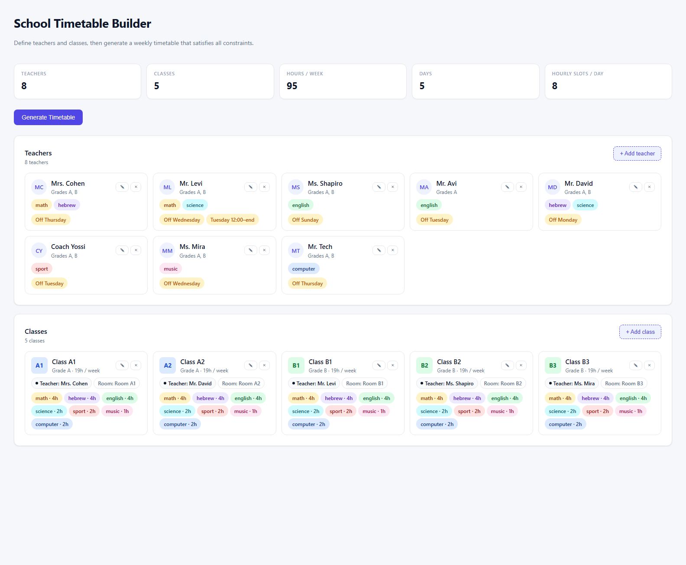
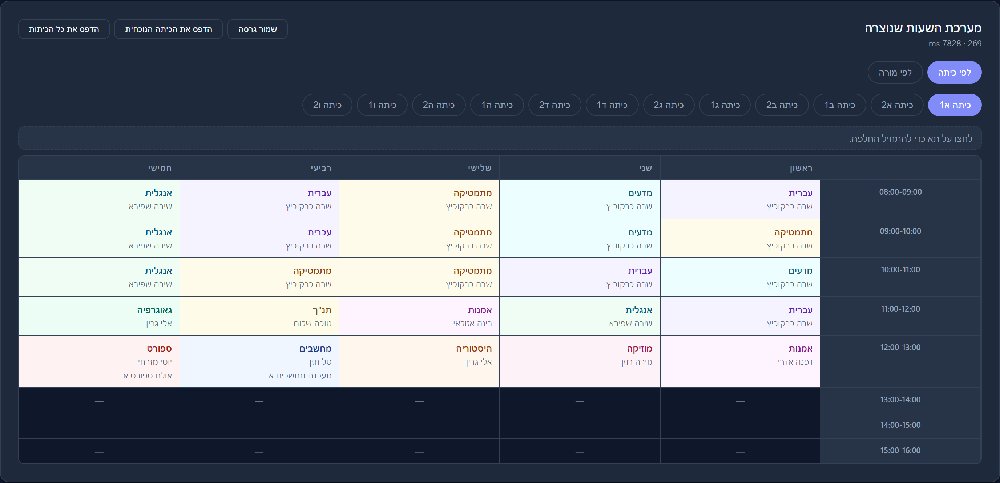
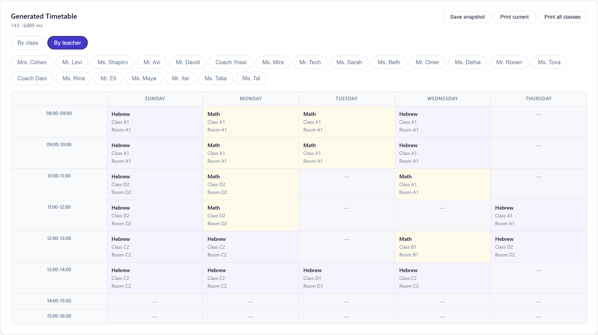

# School Timetable Builder

React + Node.js simulator that generates weekly timetables for school classes and teachers from a description of teachers, classes, subjects, and constraints.

## Screenshots







## Features

- Input model: teachers (availability, subjects, classes), classes (default teacher, default room, subjects with weekly hours), and rooms.
- Constraint-satisfaction solver (backtracking) that respects:
  - Teacher availability and no-double-booking.
  - One lesson per class per slot.
  - Sport / Computer require a special room (one class at a time).
  - 2-hour blocks per subject, except Sport and Music (1-hour blocks).
  - A class's default teacher must teach that class for any subject they can teach.
- React UI: views the demo input, runs the solver, and displays the generated timetable per class and per teacher.

## Project layout

```
timetable-app/
  server/    Express API + solver
  client/    React (Vite) UI
  package.json   root scripts
```

## Run it

```
cd timetable-app
npm run install:all
npm run dev
```

Then open http://localhost:5173 and click **Generate Timetable**.

Ports:
- Client (Vite): **5173**
- Server (Express): **4000**

API:
- `GET  /api/demo`  → demo input data
- `POST /api/solve` → run solver (body = input JSON, or empty to use demo)

## Deploy

See [DEPLOY.md](DEPLOY.md) for one-click deployment to Render. The repo's
`build` and `start` scripts are already set up for it.
